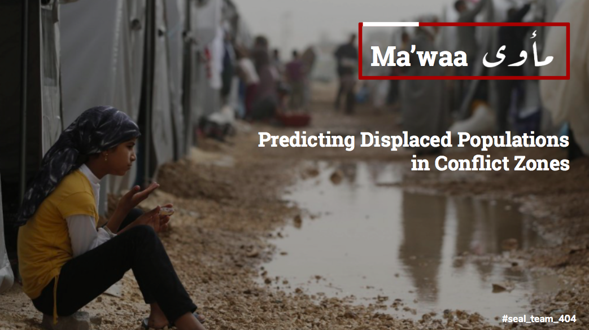
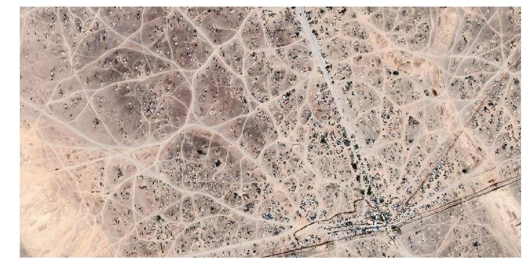
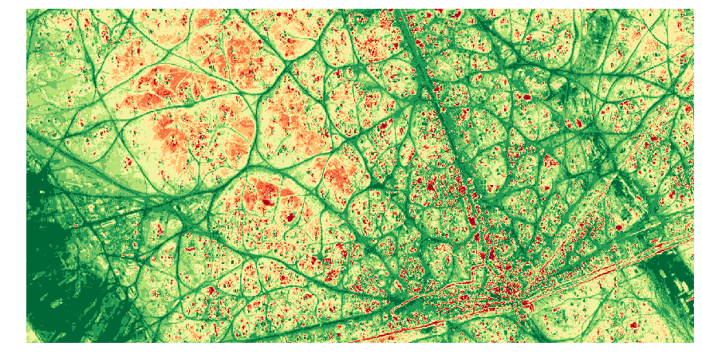
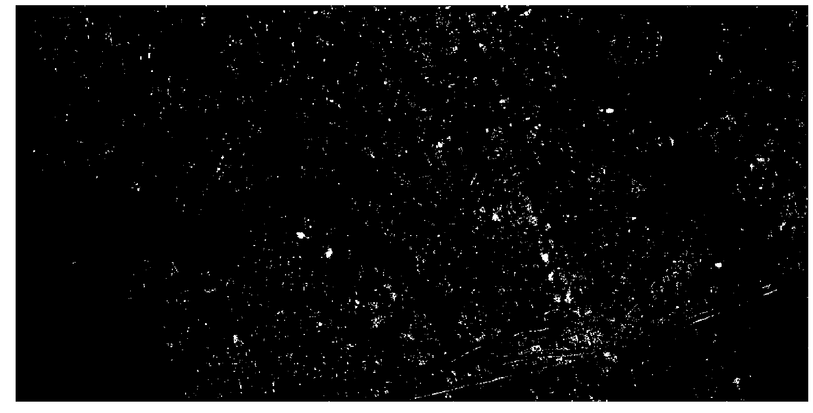
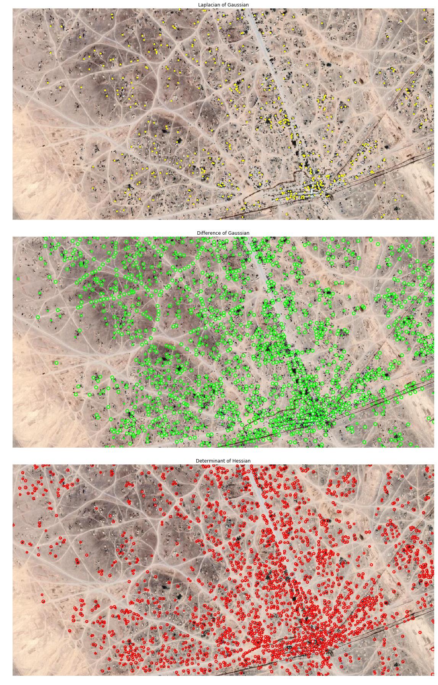

# مأوى
# Ma'waa
## Predicting Displaced Populations in Conflict Zones

### Motivation:

We no longer live in a world where refugee migration doesn’t touch us. As citizens in this global village, we are linked. Some members of our team have followed reports of refugee displacement on the news, and some of our team have seen it with their own eyes. 

This weekend, we felt particularly compelled by the challenge to collect and analyze satellite imagery to learn about land occupied by displaced populations.

### The Challenge

Design an approach that uses NASA Earth observations data to characterize land cover & land use conditions at informal settlements.

#### Seal Team 404
##### Team Not Found
Space Apps Challenge Hackathon
Seattle, WA
October 19-21, 2018

  

### Project Solution

Utilize an ensemble of various machine learning techniques including K-means clustering, open vision and time series forecasting to quantify & predict number of structures and infer populations at a refugee camp. 

* Scalable to other settlements
* Sensitive to the local geography & climate
* Can be adapted to be easily understandable for residents, humanitarians, policy makers, scientists, and others who are committed to the welfare of vulnerable populations

### Scope

  

### Modeling

Satellite imagery was taken from the Sentinel-2 dataset. For the initial analysis the image below was used:

K-means clusering, by detecting man-made structures, provides a good estimation of population density

Applying a binary filter

Several Blob Detection Algorithms are applied as well. By using a count of the detected blobs and the density of the clustering, we can estimate population density and the change of population density over time.

### Future Steps

* Engage NGOs and aid workers for greater nuanced understanding of metrics and KPIs that matter to their planning and policy making.
* Create dashboard that automatically updates population forecasts with updated satellite imagery data.
* Aggregate high resolution satellite imagery for various conflict zones to be analyzed by the Ma’waa machine learning platform to mitigate data scarcity and build robust time series forecast
* Model validation with labeled data
* Incorporating imaging from different spectra for machine learning platform
* Develop app that governments and NGOS can use to allocate resources and develop resonse plans

### Additional Background

In Northeastern corner Jordan, at the joint border of Syria and Iraq, there is a refugee camp in dire need of aid. This camp is in Rukban. It is often referred to as the most desperate settlement of Syrian refugees. This is not only due to its remoteness, but also due to the Jordanian government’s desire to restrict refugee access to Jordan from this area due to security concerns. 

The refugee population in Rukban have fled Islamic State controlled territories such as Raqqa, and the Jordanian government believes that ISIS has infiltrated these refugees. The United Nations and the Jordanian government have been at odds on this issue. Several terrorist attacks have taken place over the past two years, resulting in the deaths of Syrian refugees and Jordanian Soldiers.

On the Syrian side, the Syrian government has blocked all avenues of aid to this camp.  On the Jordanian side, humanitarian aid has halted due to the increased danger for Jordanian Soldiers and NGO workers.

As of this month, UNICEF estimates that 45,000 people live at the camp and have reported the death of two children due to starvation. The UN announced last week that preparations are underway for the first aid convoy in 9 months to reach Rukban in the next few days.

